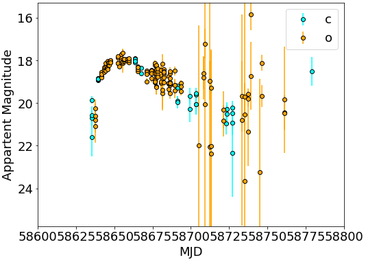
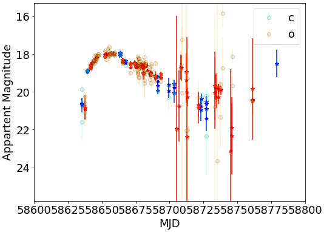
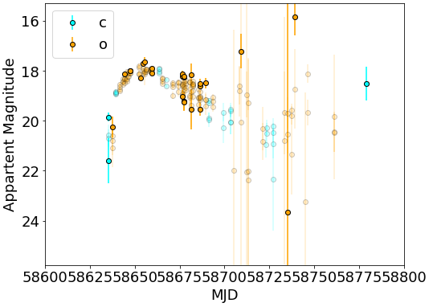

# ATLAS Object

Package for "cleaning" ATLAS light curves by doing variance-weighted rolling mean or sigma clipping.

[](https://github.com/temuller/atlas_object)
[](https://github.com/temuller/atlas_object/blob/master/LICENSE)

[](https://pypi.org/project/atlas_object/)

___
## Conda environment

It is recommended to create an environment before installing ATLAS Object:

```code
conda create -n atlas pip
conda activate atlas
pip install atlas_object
```

## Usage example

First, make sure that your data has the same output format as given by the ATLAS API. One can easily plot the light curves:

```code
import numpy as np
import matplotlib.pyplot as plt
import atlas_object as ao

# let's download a test file
ao.utils.download_test_data()

lc_file = 'test_lc.csv'  # downloaded ATLAS forced photometry file
obj = ao.atlas_object(lc_file)
obj.plot_lcs(58600, 58800)  # the user can choose the x-axis range
```


The user can choose to do a sigma clipping within the rolling mean:

```code
sigclip_kwargs = {'n_sigma':3}
obj.rolling(3, center=False, sigma_clip=True, **sigclip_kwargs)
obj.plot_lcs(58600, 58800)
```



``sigclip_kwargs`` needs to have the same input parameters as ``obj.sigma_clip()``. All the changes occur on ``obj.lcs``, while ``obj.init_lcs`` contains the initial light curves.

The user also has access to the indices of the data removed by the sigma clipping, for each band (e.g. ``obj.lcs.o.indices``):

```code
mags = np.empty(0)

fig, ax = plt.subplots(figsize=(8, 6))
for filt in 'co':
    lc = obj.init_lcs[filt]
    time = lc.time
    mag = lc.mag
    mag_err = lc.mag_err
    mask = ~obj.lcs[filt].indices
    ax.errorbar(time, mag, mag_err, 
                fmt='o', c=lc.color, mec='k',
                alpha=0.2)
    ax.errorbar(time[mask], mag[mask], mag_err[mask], 
                fmt='o', label=filt, c=lc.color, mec='k'
               )
    mags = np.r_[mags, mag]

ax.set_ylabel('Appartent Magnitude', fontsize=18)
ax.set_xlabel('MJD', fontsize=18)
ax.tick_params(labelsize=18)
ax.set_ylim(mags.min()-0.5, mags.max()+0.5)
ax.set_xlim(58600, 58800)
ax.invert_yaxis()
ax.legend(fontsize=18)
plt.show()
```



## ATLAS forced photometry

For information about public ATLAS forced photometry, check: https://fallingstar-data.com/forcedphot/.
For specific information about the data, check: https://fallingstar-data.com/forcedphot/resultdesc/.

## Contributing

To contribute, either open an issue or send a pull request (prefered option). You can also contact me directly.


## Citing ATLAS Object

If you make use of ATLAS Object, please cite:

```code
coming soon... 
```
